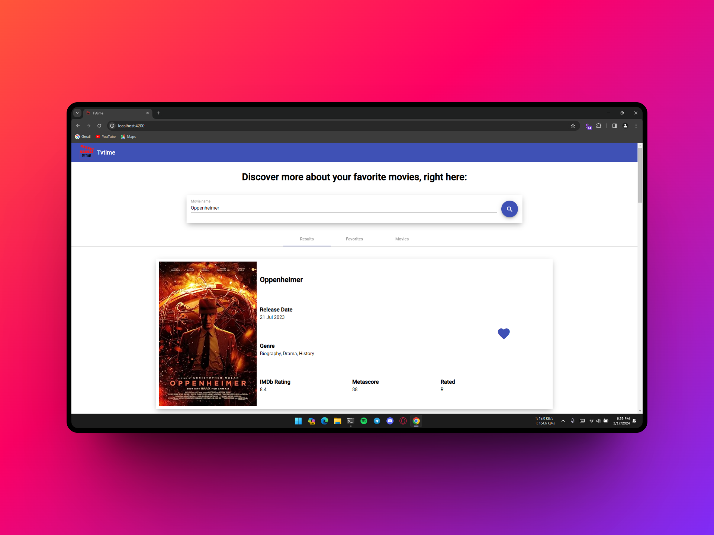
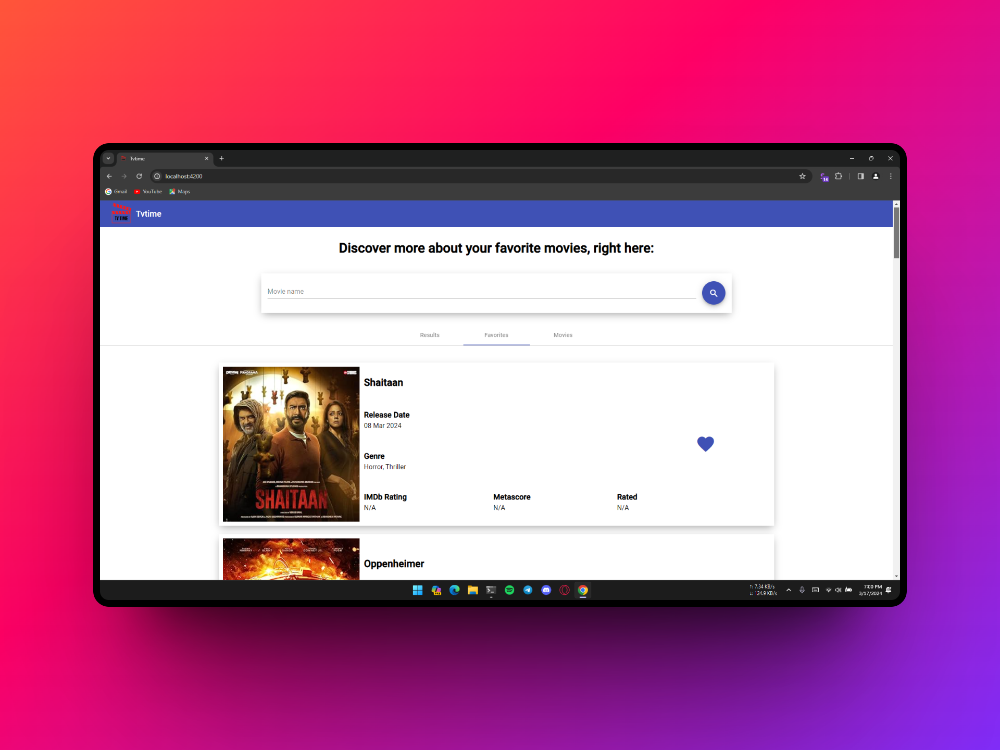
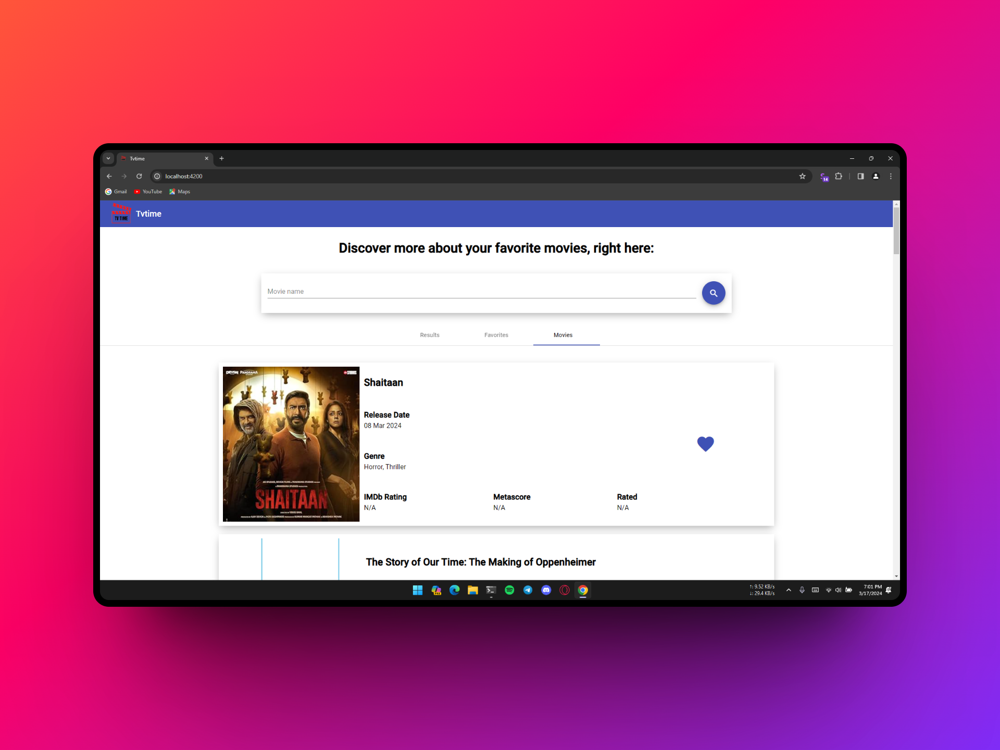
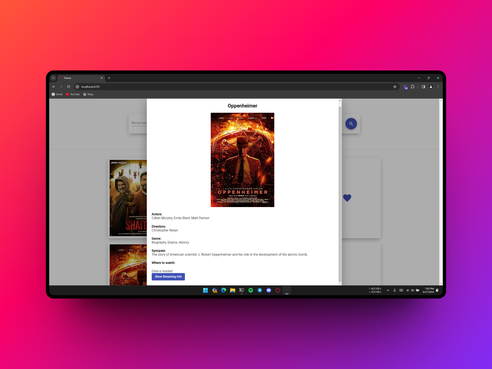
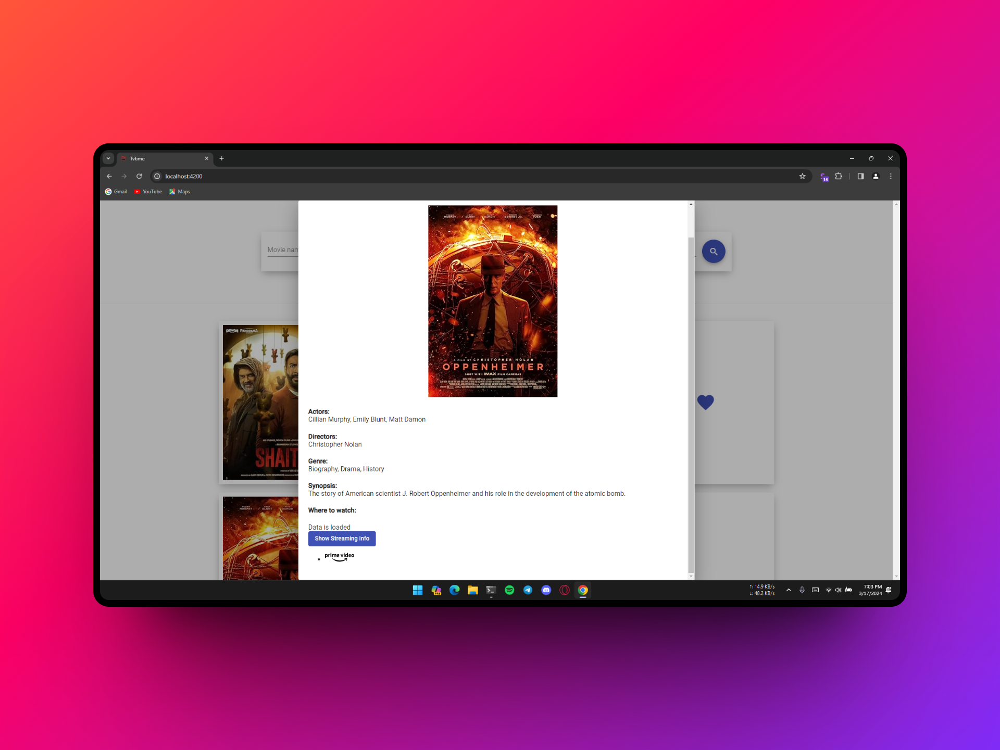

# TV Time - A Movie Watchlist App
A Movie Watchlist Project using OMDB an IMDb API, Streaming Availability API, Java Spring Boot and Angular

# Project Composition
This project is split into two components:

* The client side, located in [client](client) folder.
* The server side, located in [server](server) folder.

## Client side
The client side was built using Angular 8 with Angular Material.\
[Client README](./client/README.md)

## Server side
The server side was built using Java Spring Boot Web framework.\
[Server README](./server/README.md)

## Project Members
* [Dhruv Bhirud](https://github.com/DhruvBhirud)
* [Vaishnavi Powar](https://github.com/powar02vaishnavi)
* [Atharva Vennu](https://github.com/Phantam-gittech)
* [Hari Shelar](https://github.com/HariShelar)

## Api Used
* [OMDB API](http://www.omdbapi.com/)
* [Streaming Availability API](https://rapidapi.com/movie-of-the-night-movie-of-the-night-default/api/streaming-availability/)

## Screenshots

