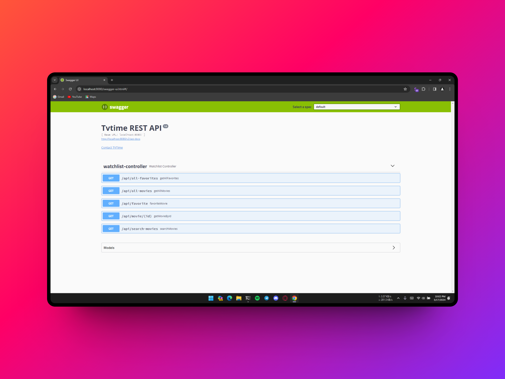
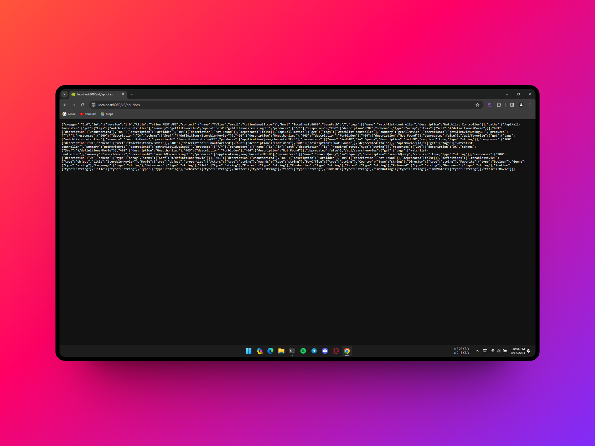

# TV Time Server Component

This is the server component from Tv Time project. This project was made using Spring Boot Framework and Java 8.

## Development Env
The project was created using Intellij Idea and no extra configuration was added when running this project, just the main Spring Application.

* Maven was used in this project instead of Gradle

## Building project
- On root directory:
```
$ mvn package
```

## Running Server
- Go to `target` folder:
```
$ cd target
```

- Run Built `.jar` file:
```
$ java -jar tvtime-0.0.1-SNAPSHOT.jar
```

Project should now be running on port 8080

- If you need to change the server port:
```
$ java -jar tvtime-0.0.1-SNAPSHOT.jar --server.port=[Port-Number]
```

## Api Implemented in Server Side
* [OMDB API](http://www.omdbapi.com/)

## Swagger Documentation
The server has a Swagger Documentation, you can access it by going to:
- [http://localhost:8080/swagger-ui.html](http://localhost:8080/swagger-ui.html)


Or get raw JSON documentation:
- [http://localhost:8080/v2/api-docs](http://localhost:8080/v2/api-docs)
